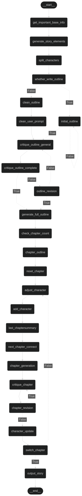

# A LangGraph implementation of a story writer workflow using LLMs. 

This work is inspired by https://github.com/datacrystals/AIStoryWriter.

This project mainly focuses on Chinese stories, so the prompts and examples are in Chinese. However, you can adapt it to other languages by modifying the prompts.

# Workflow:



# Functionality:
- **Generate a story based on a single sentence**: The workflow is designed to generate stories based on a single idea, such as a single sentence describing the story.
- **Convert an existing outline to story**: The workflow can also convert an existing outline into a story. You can provide an outline in the `prompts` folder, and the workflow will generate a story based on that outline.
- **Story element restrictions**: The workflow allows you to set restrictions on story elements, such as the style of story, the elements that must (or should not) be included in the story, and the number of chapters in the story. You can specify these restrictions in the prompt file.

# Install dependencies

The dependencies is already available in the "uv.lock" file, use uv to install the dependencies:

```bash
uv sync
```

# Configuration:

This work only supports Together's API for now. You need to set the `TOGETHER_API_KEY` environment variable in the .env file as your Together API key.

# Usage:

#### This work is still in a very primitive state. The usage is not very user-friendly yet.

To generate a story, you can do the following steps:

### Step 1: Create a prompt file
create your prompt in the `prompts` folder, you can refer to the example prompts in the `prompts` folder.

### Step 2: Run the main.py script
Run the `main.py` script with the name of your story as an argument.
```bash
python main.py <story_name>
```
Here, `<story_name>` is the name of the prompt file without the `.txt` extension. For example, if your prompt file is `my_story.txt`, you can run:
```bash
python main.py my_story
```

### Step 3: Monitor the generation process
The LLM's response in each step will be saved in a folder titled with `Generation<timestamp>`. where `<timestamp>` is the current timestamp in the format `YYYY-MM-DD-HH-MM-SS`. You can check the LLM's response if you found something unexpected in the generated story.


### Step 4: Check the final story
The final story will be saved in the `stories` folder with the name `<story_name><timestamp>.txt`, where `<timestamp>` is the current timestamp in the format `YYYY-MM-DD-HH-MM-SS`.

# Hints
DeepSeek V3 performs very well in Chinese storytelling, you can use it from Together's API.